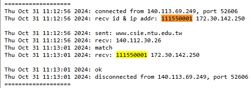

# Assignment 3

> https://people.cs.nycu.edu.tw/~lhyen/np/ass3/np24f_ass3t.html

> 本次上機恰好遇到颱風假，改為在住家考試，一樣在 Linux 環境底下連至提供的伺服器做測試。同樣必須連線至 Final Server ，有提供 Server 的 log 檔案讓學生檢視自己是否有通過。

## 作業概述（引用）

此次作業要求你寫一個TCP client程式，與一個已經存在的TCP server程式通訊。 你的client程式必須有能力將server給定的 host name 轉換成 IP 位址 (Ch. 11)。

1. 你可以改寫第五章的 Echo client (tcpcliserv/tcpcli01.c) 程式，但port改為SERV_PORT+2。
2. 此 client 與 server 的連結建立後，client程式先送出你的學號及client的IP位址(以空格隔開)給server。
3. Server 收到後，會送出某個 host name (如 www.nycu.edu.tw)。
4. 你的 client 收到後，以字串型式回傳此 host name 對應的IP位址。
5. 如果server判定IP位址正確，會回傳 "good"。
6. 如果server判定IP位址不正確，會回傳 "bad"，並結束此連線。
7. 如果收到server回應的 "good"，client 程式需再次送出你的學號及client的IP位址(以空格隔開)給server。
8. 如果學號及client的IP位址之前傳送的相同，server會回傳 "ok"，否則會回傳 "nak"。
一個正確的執行流程範例如下圖所示。

假設我們先將tcpcli01.c複製成為另一個 test_cli.c。接下來 你可以用 Unix 下的 vi 或 GNOME 桌面下的 gedit 來編輯此程式。 事實上你要做的事有六件：
1. 改寫 main 中程式碼，使建立連結的 server port 為 SERV_PORT+2。
2. 改寫該程式中main呼叫的 str_cli 函數 (位於 lib/str_cli.c)。你可以將此函數的內容複製到和 main 同一個程式檔案中，再將將此函數改名(如xchg_data)。
3. 以程式碼填入資料方式送出你的學號和IP位址。程式需使用 getsockname (第四章) 及 inet_ntoa (第三章) 得到client的IP位址並以字串方式送出。
4. 於收到 server 送來的 host name 字串後，以程式碼填入資料方式送出對應的 IP 位址字串 (參考Ch. 11)。
5. 如果收到server 送來的 "good" 訊息，再一次以程式碼填入資料方式送出你的學號和IP位址。。
6. 確定收到 "ok" 訊息以確定程式最終正確性。

修改完程式後，請參考此網頁來編譯你的程式。

## 作業重點

可以沿用先前的作業，便不須再修改取得本地 IP 的過程。程式碼當中有一些未使用的變數，在編譯期間會產生警告，不過不影響結果。

- 整個完整的程式執行不需要手動輸入，其實可以不需要 stdin 。
- 程式執行也不會有迴圈存在（bad 或 nak 會結束連線），也可以不用 while 。
- 取得主機 IP 要使用 `inet_ntop(hptr->h_addrtype, hptr->h_addr, str, sizeof(str))` ，不確定原因，但如果照課本的方法使用 `hptr->h_addr_list` 會收到錯誤的位址。